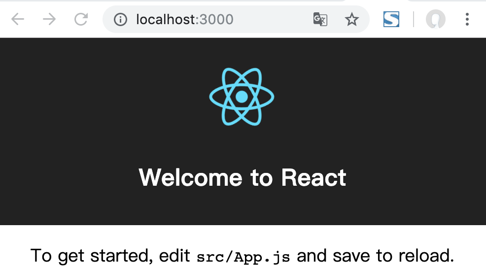

# React学习笔记
## 创建项目
Mac:
```
$ cnpm install -g create-react-app
$ create-react-app my-app
$ cd my-app/
$ npm start
```
Windows:
```
npx create-react-app my-app
cd my-app
npm start
```

效果图：


## 面试点
* 虚拟DOM，不总是直接操作DOM
* DOM Diff算法，最小化页面重绘，减小重绘点区域，提高效率

## 相关js库
* react.js:React的核心库
* react-dom.js:提供操作DOM的react扩展库
* babel.min.js:解析JSX语法代码转为纯JS语法代码的库，还有个功能ES6转ES5，我们写的JSX代码，这个库解析成JS代码

# 参考学习链接
* [菜鸟教程](https://www.runoob.com/react/react-install.html)
* [尚硅谷](https://www.bilibili.com/video/av51174155?from=search&seid=15105180625631138353)
* [中文官网](https://zh-hans.reactjs.org/)
* [react-pxq开源项目](https://github.com/bailicangdu/react-pxq)
* [react库 bootcnd](https://www.bootcdn.cn/react/)
